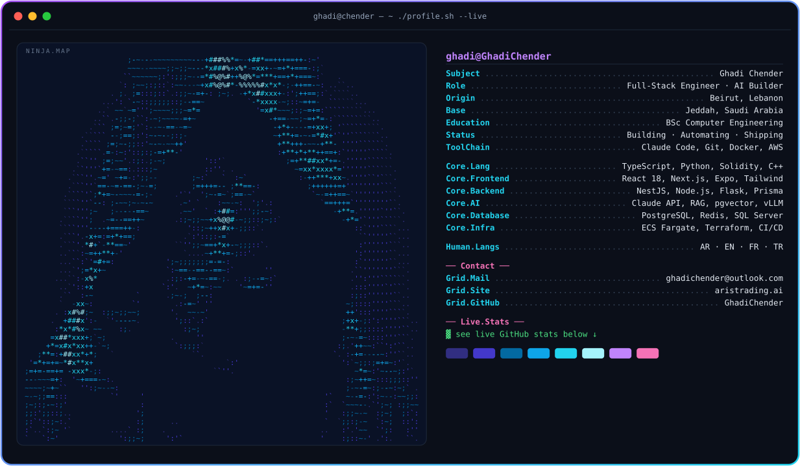

<picture>
  <source media="(prefers-color-scheme: dark)" srcset="dark.svg">
  <source media="(prefers-color-scheme: light)" srcset="light.svg">
  
</picture>

 

<picture>
  <source media="(prefers-color-scheme: dark)" srcset="https://github-profile-summary-cards.vercel.app/api/cards/stats?username=GhadiChender&theme=github_dark">
  
</picture>

  

<picture>
  <source media="(prefers-color-scheme: dark)" srcset="https://raw.githubusercontent.com/GhadiChender/GhadiChender/output/github-contribution-grid-snake-dark.svg">
  <source media="(prefers-color-scheme: light)" srcset="https://raw.githubusercontent.com/GhadiChender/GhadiChender/output/github-contribution-grid-snake.svg">
  
</picture>

 

card generated by <a href="ascii_to_svg.py"><code>ascii_to_svg.py</code></a> — image → ASCII → SVG

