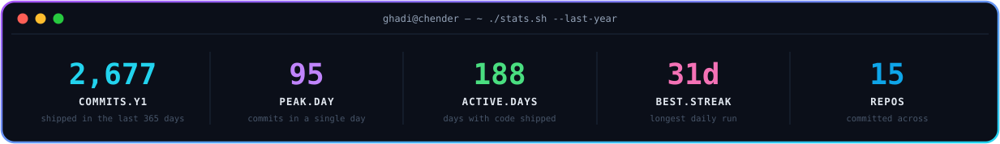

<picture>
  <source media="(prefers-color-scheme: dark)" srcset="dark.svg">
  <source media="(prefers-color-scheme: light)" srcset="light.svg">
  
</picture>

 

<picture>
  <source media="(prefers-color-scheme: dark)" srcset="stats-dark.svg">
  <source media="(prefers-color-scheme: light)" srcset="stats-light.svg">
  
</picture>

  

<picture>
  <source media="(prefers-color-scheme: dark)" srcset="https://raw.githubusercontent.com/GhadiChender/GhadiChender/output/github-contribution-grid-snake-dark.svg">
  <source media="(prefers-color-scheme: light)" srcset="https://raw.githubusercontent.com/GhadiChender/GhadiChender/output/github-contribution-grid-snake.svg">
  
</picture>

 

